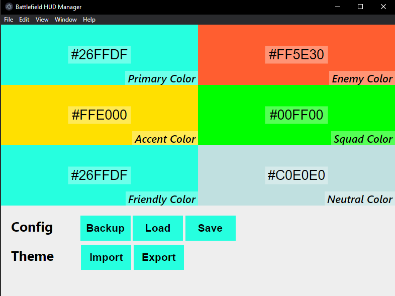

# Battlefield HUD Manager

A Battlefield HUD Manager for creating/saving and patching themes for your BF2042 config.

Because HUD colors are a bit finnicky to change in BF2042 setting menu, I created a tool you can use to properly change and save your HUD colors.

## This tool supports:
- Hex-Colors, which you can type or just paste in
- A color picker
- Exporting/Importing themes in a `.json` format
  - (share them with your friends! 👀)

## How to use it?
0. Close Battlefield 2042
1. Open bftheme.exe and load your PROFSAVE_profile config (located in the Documents/Battlefield2042/settings folder)
2. Adjust your colors how you want with the color picker or the textfield
3. Open a theme via the **Import** button or export a theme via the **Export** button
4. Save your theme via the **Save** button

Now your theme should be applied within the game.

## What's coming next?

I am currently thinking about creating a preview feature, so that you don't need to reopen the game all the time.
There is also the import of base-16 themes in the works, which you can then drag and drop how you want.
Additionally, the file validation is pretty naive. I am trying to get the hang of it, but so far this should be enough.

The UI will also change once again as this is a pre-release of the tool.